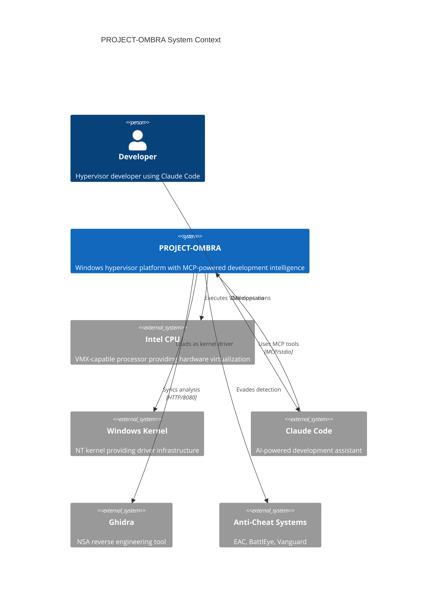

# C4 Model: System Context

## Context Diagram



## Context Description

### Primary Actors

| Actor | Description | Interaction |
|-------|-------------|-------------|
| **Developer** | Hypervisor developer using Claude Code for assisted development | Uses Claude to generate code, validate VMCS, audit stealth |
| **Claude Code** | AI development assistant with MCP integration | Calls 211 tools across two MCP servers |

### External Systems

| System | Description | Integration |
|--------|-------------|-------------|
| **Intel CPU** | VMX-capable processor (Haswell+) | VMXON/VMLAUNCH/VMCALL instructions |
| **Windows Kernel** | NT kernel (Windows 10/11 x64) | Driver loading, kernel APIs |
| **Ghidra** | Reverse engineering tool | HTTP bridge for bidirectional sync |
| **Anti-Cheat Systems** | EAC, BattlEye, Vanguard | Target for stealth evasion |

## System Boundaries

### Internal Scope

1. **Hypervisor Core**: VMX virtualization engine
2. **Kernel Driver**: Windows .sys driver interface
3. **Usermode Tools**: Loader, BYOVD exploiter, client API
4. **MCP Servers**: Development intelligence (ombra-mcp, driver-re-mcp)
5. **Databases**: Reference data, project state, anti-cheat intel

### External Dependencies

| Dependency | Type | Purpose |
|------------|------|---------|
| Intel SDM | Documentation | VMX specification reference |
| MSVC Toolchain | Build | Compilation (cl.exe, ml64.exe) |
| Python 3.10+ | Runtime | MCP server execution |
| ChromaDB | Library | Vector similarity search |
| SQLite | Database | Persistent storage |

## Data Flows

### Development Flow

```
Developer ─── Claude Code ─── MCP Server ─── Databases
                  │                             │
                  ▼                             ▼
             Code Output ◄───────────── Intel SDM Reference
```

### Runtime Flow

```
Target Process ─── Usermode Client ─── Kernel Driver ─── Hypervisor
                                              │
                                              ▼
                                       Physical Memory
```

### Detection Evasion Flow

```
Anti-Cheat ──(scans)──► Guest Memory (visible)
                              │
                              │ EPT Split-View
                              ▼
                        Hidden Memory (invisible)
```

## Security Context

### Trust Boundaries

```
┌─────────────────────────────────────────────────────────┐
│                    UNTRUSTED                            │
│  • Anti-cheat scanning                                  │
│  • Guest OS memory views                                │
│  • Timing measurements from guest                       │
└─────────────────────────────────────────────────────────┘
                          │
                          │ EPT Virtualization
                          ▼
┌─────────────────────────────────────────────────────────┐
│                    TRUSTED (VMX Root)                   │
│  • Hypervisor memory                                    │
│  • EPT structures                                       │
│  • VMCS data                                            │
│  • Shadow hook code                                     │
└─────────────────────────────────────────────────────────┘
```

### Threat Model

| Threat | Mitigation |
|--------|------------|
| Timing-based detection | TSC/APERF/MPERF compensation |
| CPUID enumeration | Hypervisor bit masking, leaf spoofing |
| Memory scanning | EPT split-view (execute vs read) |
| BigPool enumeration | MDL allocation, PML4E hiding |
| ETW tracing | ETW buffer wiping, trace disabling |

## Related Documents

- [02-C4-CONTAINERS.md](./02-C4-CONTAINERS.md) - Container architecture
- [05-SECURITY-ARCHITECTURE.md](./05-SECURITY-ARCHITECTURE.md) - Detailed threat model
