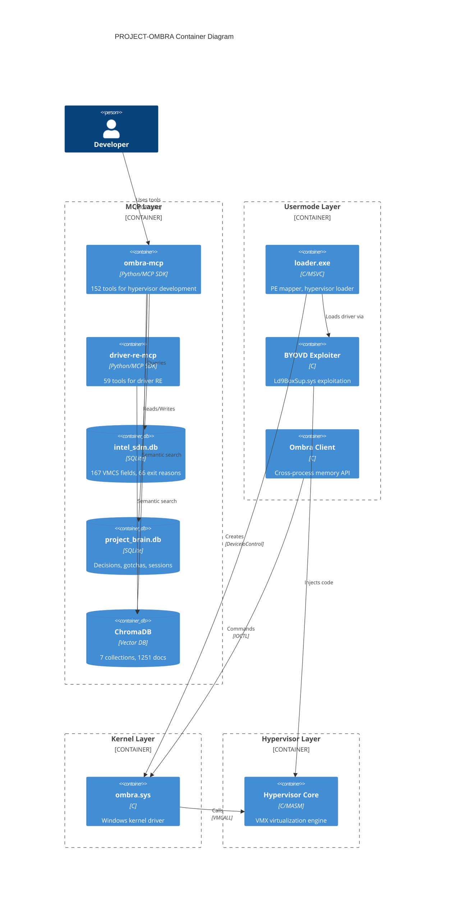

# C4 Model: Container Diagram

## Container Architecture



## Container Details

### MCP Layer Containers

| Container | Technology | Tools | Purpose |
|-----------|------------|-------|---------|
| **ombra-mcp** | Python 3.10+, MCP SDK | 152 | Intel SDM queries, code gen, stealth audit |
| **driver-re-mcp** | Python 3.10+, MCP SDK | 59 | Driver analysis, IOCTL vuln, Ghidra sync |
| **intel_sdm.db** | SQLite 225KB | - | VMCS fields, exit reasons, MSRs |
| **project_brain.db** | SQLite 14MB | - | Project state, decisions, gotchas |
| **ChromaDB** | ONNX + SQLite 8.5MB | - | Vector embeddings (384-dim) |

### Usermode Layer Containers

| Container | Files | Purpose |
|-----------|-------|---------|
| **loader.exe** | hv_loader.c, pe_*.c | PE parsing, hypervisor loading |
| **BYOVD Exploiter** | supdrv.c, throttlestop.c, deployer.c | Kernel code execution via vulnerable drivers |
| **Ombra Client** | ombra_client.c, ombra.h | Public API for memory operations |

### Kernel Layer Containers

| Container | Files | Commands |
|-----------|-------|----------|
| **ombra.sys** | dispatch.c, vmcall.c, memory_ops.c | 30+ dispatch handlers |

### Hypervisor Layer Containers

| Container | Files | Handlers |
|-----------|-------|----------|
| **Hypervisor Core** | vmx.c, vmcs.c, ept.c, exit_dispatch.c | 12+ exit handlers |

## Communication Protocols

### MCP Communication

```
Claude Code ◄──── stdio ────► MCP Server
                              │
                              ├── list_tools() → Tool schemas
                              ├── call_tool() → JSON result
                              └── resources() → Static content
```

### Usermode ↔ Driver

```
Usermode Client                    Kernel Driver
      │                                  │
      │ CreateFile(DEVICE_NAME)          │
      │ ─────────────────────────────►   │
      │                                  │
      │ DeviceIoControl(IOCTL_COMMAND)   │
      │ ─────────────────────────────►   │
      │       ◄───────────────────────   │
      │         Response buffer          │
```

### Driver ↔ Hypervisor (VMCALL)

```
x64 Calling Convention:
  RAX = OMBRA_VMCALL_MAGIC (authentication)
  RCX = Command code
  RDX = OMBRA_VMCALL_KEY (authentication)
  R8  = Param1
  R9  = Param2
  R10 = Param3

Return:
  RAX = Status code (OMBRA_STATUS)
  RDX = Optional output 1
  R8  = Optional output 2
```

## Data Stores

### Database Distribution

| Database | Container | Size | Tables |
|----------|-----------|------|--------|
| intel_sdm.db | ombra-mcp | 225KB | 4 |
| project_brain.db | ombra-mcp | 14MB | 6 |
| vergilius.db | ombra-mcp | 3.2MB | 5+ |
| mslearn_reference.db | ombra-mcp | 905KB | 4 |
| anticheat_intel.db | ombra-mcp | 118KB | 4 |
| evasion_techniques.db | ombra-mcp | 118KB | 4 |
| byovd_drivers.db | ombra-mcp | 61KB | 5 |
| driver_re.db | both | 168KB | 16 |

### ChromaDB Collections

| Collection | Documents | Purpose |
|------------|-----------|---------|
| intel_sdm | ~200 | VMX specification chunks |
| anticheat_intel | ~100 | Detection method descriptions |
| evasion_techniques | ~50 | Bypass technique descriptions |
| byovd_drivers | ~30 | Vulnerable driver documentation |
| mslearn_reference | ~400 | Microsoft API documentation |
| project_brain | ~300 | Project decisions and gotchas |
| vergilius | ~170 | Windows kernel structure docs |

## Deployment View

```
┌─────────────────────────────────────────────────────────┐
│                    Host Machine                         │
│                                                         │
│  ┌───────────────────────────────────────────────────┐  │
│  │                 Python Environment                 │  │
│  │   ombra-mcp    driver-re-mcp    ChromaDB         │  │
│  │   (stdio)      (stdio)          (embedded)        │  │
│  └───────────────────────────────────────────────────┘  │
│                                                         │
│  ┌───────────────────────────────────────────────────┐  │
│  │                 Windows Usermode                   │  │
│  │   loader.exe   BYOVD chain   Ombra Client        │  │
│  └───────────────────────────────────────────────────┘  │
│                                                         │
│  ┌───────────────────────────────────────────────────┐  │
│  │                 Windows Kernel                     │  │
│  │              ombra.sys (loaded)                    │  │
│  └───────────────────────────────────────────────────┘  │
│                                                         │
│  ┌───────────────────────────────────────────────────┐  │
│  │                 VMX Root Mode                      │  │
│  │            Hypervisor Core (active)                │  │
│  └───────────────────────────────────────────────────┘  │
└─────────────────────────────────────────────────────────┘
```

## Related Documents

- [01-C4-CONTEXT.md](./01-C4-CONTEXT.md) - System context
- [03-C4-COMPONENTS.md](./03-C4-COMPONENTS.md) - Component details
- [04-DATA-ARCHITECTURE.md](./04-DATA-ARCHITECTURE.md) - Database schemas
