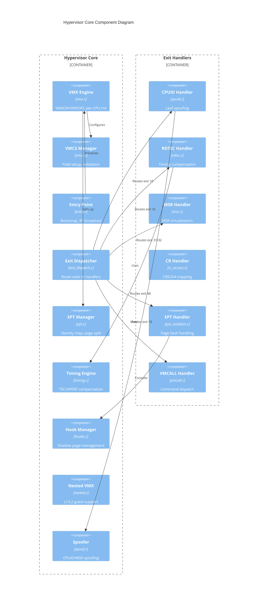
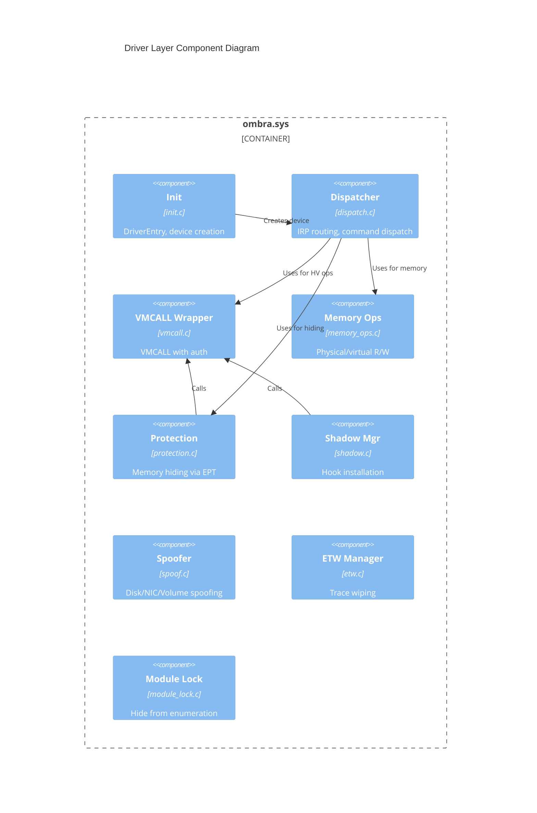
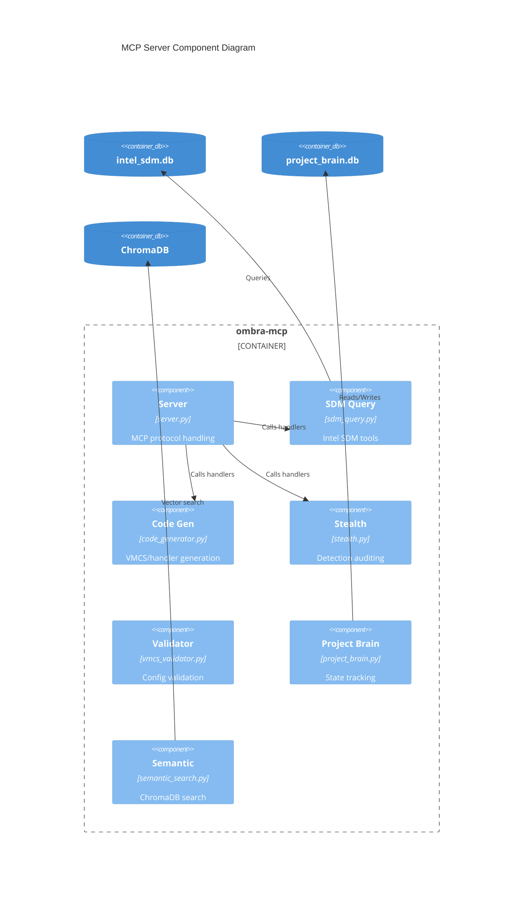

# C4 Model: Component Diagram

## Hypervisor Core Components



## Component Details: Hypervisor Core

| Component | File | Size | Responsibility |
|-----------|------|------|----------------|
| **VMX Engine** | vmx.c/h | 12.5KB | VMXON/VMXOFF lifecycle, per-CPU VMX_CPU structures, MSR capability checking |
| **VMCS Manager** | vmcs.c/h | 23KB | VMCS initialization, control/guest/host field setup, field validation |
| **Entry Point** | entry.c | 12KB | Hypervisor bootstrap, `HvEntry()`, multi-CPU IPI via `KeIpiGenericCall` |
| **Exit Dispatcher** | exit_dispatch.c/h | 7.2KB | Read EXIT_REASON, switch to appropriate handler, handle unimplemented exits |
| **EPT Manager** | ept.c/h | 29KB | Identity mapping, large page optimization, 4KB splitting, `INVEPT` |
| **Timing Engine** | timing.c/h | 17KB | TSC offset calculation, APERF/MPERF compensation, exit cost tracking |
| **Hook Manager** | hooks.c/h | 44KB | Shadow page allocation, execute-only pages, read/execute split |
| **Nested VMX** | nested.c/h | 21KB | L1/L2 guest support, VMCS shadowing (partial) |
| **Spoofer** | spoof.c/h | 8.8KB | CPUID leaf modification, MSR hiding, SMBIOS spoofing |

## Component Details: Exit Handlers

| Handler | Exit Reason | File | Purpose |
|---------|-------------|------|---------|
| **CPUID** | 10 | cpuid.c | Mask hypervisor bit, spoof vendor ID, modify feature flags |
| **RDTSC** | 16 | rdtsc.c | Apply TSC offset, compensate for exit latency |
| **MSR** | 31/32 | msr.c | Virtualize VMX MSRs, shadow values, passthrough optimization |
| **CR Access** | 28 | cr_access.c | Trap CR0.WP changes, CR3 updates, CR4.VMXE |
| **EPT Violation** | 48 | ept_violation.c | Handle page faults, update EPT entries, trigger hooks |
| **EPT Misconfig** | 49 | ept_misconfig.c | Debug EPT configuration errors |
| **VMCALL** | 18 | vmcall.c | Authenticate caller, dispatch 30+ command codes |
| **Exception** | 0 | exception.c | Inject exceptions, handle NMI, debug traps |
| **I/O** | 30 | io.c | Virtualize I/O ports |
| **MTF** | 37 | mtf.c | Single-step execution for debugging |
| **Power** | 1 | power_mgmt.c | Handle HLT, power state transitions |

## Driver Layer Components



## Component Details: Driver

| Component | File | Commands |
|-----------|------|----------|
| **Init** | init.c | DriverEntry, IRP_MJ_CREATE/CLOSE |
| **Dispatcher** | dispatch.c | 30+ command handlers |
| **VMCALL Wrapper** | vmcall.c | Authenticated VMCALL execution |
| **Memory Ops** | memory_ops.c | ReadPhysical, WritePhysical, ReadVirtual, WriteVirtual |
| **Protection** | protection.c | HideMemory, ShadowMemory via EPT |
| **Shadow Manager** | shadow.c | InstallShadow, RemoveShadow |
| **Spoofer** | spoof.c | SpoofDisk, SpoofNic, SpoofVolume |
| **ETW Manager** | etw.c | EtwDisableTi, EtwWipeBuffer |
| **Module Lock** | module_lock.c | Hide from PEB/LDR enumeration |

## MCP Server Components



## Component Details: ombra-mcp

| Component | File | Tools |
|-----------|------|-------|
| **Server** | server.py | list_tools, call_tool, resource handlers |
| **SDM Query** | sdm_query.py | vmcs_field_complete, exit_reason_complete, get_msr_info |
| **Code Gen** | code_generator.py | generate_vmcs_setup, generate_exit_handler, generate_ept_setup |
| **Stealth** | stealth.py | get_detection_vectors, audit_stealth, generate_timing_compensation |
| **Validator** | vmcs_validator.py | validate_vmcs_setup, get_vmcs_checklist |
| **Project Brain** | project_brain.py | add_decision, add_gotcha, get_findings |
| **Semantic** | semantic_search.py | semantic_search, rebuild_semantic_index |

## Data Structures

### VMX_CPU (Per-CPU State)

```c
typedef struct _VMX_CPU {
    // Identification
    U32 CpuId;
    BOOLEAN Active;

    // VMX Regions (page-aligned)
    void *VmxonRegion;      // 4KB VMXON region
    void *VmcsRegion;       // 4KB VMCS region

    // Host Stack
    void *HostStackBase;    // 16KB host stack
    void *HostStackTop;

    // MSR Bitmap
    void *MsrBitmap;        // 4KB MSR intercept bitmap

    // EPT (shared reference)
    struct _EPT_STATE* Ept;

    // Timing Compensation
    U64 VmexitCount;
    U64 TscOffset;
    U64 AperfOffset;
    U64 MperfOffset;
    U64 LastExitTsc;

    // Per-CPU hooks
    struct _HOOK_ENTRY* Hooks[MAX_HOOKS];
} VMX_CPU;
```

### OMBRA_COMMAND (Driver Command)

```c
typedef struct _OMBRA_COMMAND {
    U32 CommandId;          // Command code
    U32 Status;             // Result status
    U64 Param1;             // Input parameter 1
    U64 Param2;             // Input parameter 2
    U64 Param3;             // Input parameter 3
    U64 Param4;             // Input parameter 4
    U64 Result1;            // Output value 1
    U64 Result2;            // Output value 2
} OMBRA_COMMAND;
```

## Related Documents

- [02-C4-CONTAINERS.md](./02-C4-CONTAINERS.md) - Container architecture
- [04-DATA-ARCHITECTURE.md](./04-DATA-ARCHITECTURE.md) - Database details
