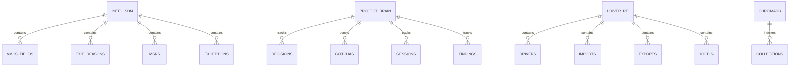

# Data Architecture

## Database Overview

PROJECT-OMBRA uses 8 SQLite databases plus ChromaDB for vector search, totaling ~27MB of reference data.



## Database Catalog

| Database | Location | Size | Tables | Purpose |
|----------|----------|------|--------|---------|
| **intel_sdm.db** | ombra_mcp/data/ | 225KB | 4 | Intel SDM reference data |
| **project_brain.db** | ombra_mcp/data/ | 14MB | 6 | Project state and history |
| **vergilius.db** | ombra_mcp/data/ | 3.2MB | 5+ | Windows kernel structures |
| **mslearn_reference.db** | ombra_mcp/data/ | 905KB | 4 | Microsoft API documentation |
| **anticheat_intel.db** | ombra_mcp/data/ | 118KB | 4 | Anti-cheat detection methods |
| **evasion_techniques.db** | ombra_mcp/data/ | 118KB | 4 | Bypass techniques |
| **byovd_drivers.db** | ombra_mcp/data/ | 61KB | 5 | Vulnerable driver catalog |
| **driver_re.db** | ombra_mcp/data/ | 168KB | 16 | Driver RE analysis |

## Schema Details

### intel_sdm.db

```sql
-- VMCS Fields (167 records)
CREATE TABLE vmcs_fields (
    encoding INTEGER PRIMARY KEY,
    name TEXT NOT NULL,
    category TEXT,        -- guest_state, host_state, control, exit_info
    width TEXT,           -- 16, 32, 64, natural
    access_type TEXT,     -- full, high
    description TEXT,
    sdm_section TEXT,
    sdm_page INTEGER
);

-- Exit Reasons (66 records)
CREATE TABLE exit_reasons (
    reason_number INTEGER PRIMARY KEY,
    name TEXT NOT NULL,
    description TEXT,
    qualification_format TEXT,  -- JSON schema of bits
    control_bit TEXT,
    sdm_section TEXT
);

-- MSRs (35 records)
CREATE TABLE msrs (
    address INTEGER PRIMARY KEY,
    name TEXT NOT NULL,
    description TEXT,
    read_mask TEXT,
    write_mask TEXT,
    category TEXT
);

-- Exceptions (20 records)
CREATE TABLE exceptions (
    vector INTEGER PRIMARY KEY,
    name TEXT NOT NULL,
    mnemonic TEXT,
    type TEXT,        -- fault, trap, interrupt, abort
    error_code BOOLEAN,
    description TEXT
);
```

### project_brain.db

```sql
-- Architectural Decisions
CREATE TABLE decisions (
    id INTEGER PRIMARY KEY AUTOINCREMENT,
    title TEXT NOT NULL,
    context TEXT,
    decision TEXT NOT NULL,
    consequences TEXT,
    status TEXT DEFAULT 'accepted',
    created_at TEXT DEFAULT CURRENT_TIMESTAMP
);

-- Gotchas and Lessons Learned
CREATE TABLE gotchas (
    id INTEGER PRIMARY KEY AUTOINCREMENT,
    category TEXT,
    title TEXT NOT NULL,
    description TEXT,
    solution TEXT,
    prevention TEXT,
    created_at TEXT DEFAULT CURRENT_TIMESTAMP
);

-- Work Sessions
CREATE TABLE sessions (
    id TEXT PRIMARY KEY,
    started_at TEXT DEFAULT CURRENT_TIMESTAMP,
    ended_at TEXT,
    summary TEXT,
    files_modified TEXT,  -- JSON array
    decisions_made TEXT   -- JSON array of decision IDs
);

-- Security Findings
CREATE TABLE findings (
    id INTEGER PRIMARY KEY AUTOINCREMENT,
    severity TEXT,        -- critical, high, medium, low
    category TEXT,
    title TEXT NOT NULL,
    description TEXT,
    remediation TEXT,
    status TEXT DEFAULT 'open',
    created_at TEXT DEFAULT CURRENT_TIMESTAMP
);

-- Implementation Components
CREATE TABLE components (
    name TEXT PRIMARY KEY,
    status TEXT,          -- implemented, partial, stubbed
    file_path TEXT,
    notes TEXT,
    last_verified TEXT
);

-- VMX Concepts
CREATE TABLE concepts (
    id TEXT PRIMARY KEY,
    name TEXT NOT NULL,
    category TEXT,
    description TEXT,
    implementation_status TEXT,
    verified BOOLEAN DEFAULT 0
);
```

### driver_re.db (Full Schema)

```sql
-- Driver Metadata
CREATE TABLE drivers (
    id TEXT PRIMARY KEY,
    original_name TEXT NOT NULL,
    analyzed_name TEXT,
    md5 TEXT NOT NULL,
    sha1 TEXT NOT NULL,
    sha256 TEXT NOT NULL UNIQUE,
    imphash TEXT,
    file_size INTEGER NOT NULL,
    image_base INTEGER NOT NULL,
    entry_point_rva INTEGER NOT NULL,
    file_version TEXT,
    product_version TEXT,
    company_name TEXT,
    analysis_status TEXT DEFAULT 'pending',
    notes TEXT,
    tags TEXT,
    created_at TEXT DEFAULT CURRENT_TIMESTAMP,
    updated_at TEXT DEFAULT CURRENT_TIMESTAMP
);

-- PE Sections
CREATE TABLE sections (
    id INTEGER PRIMARY KEY AUTOINCREMENT,
    driver_id TEXT NOT NULL REFERENCES drivers(id) ON DELETE CASCADE,
    name TEXT NOT NULL,
    virtual_address INTEGER NOT NULL,
    virtual_size INTEGER NOT NULL,
    raw_size INTEGER NOT NULL,
    characteristics INTEGER NOT NULL,
    entropy REAL,
    UNIQUE(driver_id, name)
);

-- Import Table (IAT)
CREATE TABLE imports (
    id INTEGER PRIMARY KEY AUTOINCREMENT,
    driver_id TEXT NOT NULL REFERENCES drivers(id) ON DELETE CASCADE,
    module_name TEXT NOT NULL,
    function_name TEXT NOT NULL,
    ordinal INTEGER,
    is_dangerous BOOLEAN DEFAULT 0,
    danger_reason TEXT,
    category TEXT,
    UNIQUE(driver_id, module_name, function_name)
);

-- Export Table (EAT)
CREATE TABLE exports (
    id INTEGER PRIMARY KEY AUTOINCREMENT,
    driver_id TEXT NOT NULL REFERENCES drivers(id) ON DELETE CASCADE,
    name TEXT NOT NULL,
    ordinal INTEGER NOT NULL,
    rva INTEGER NOT NULL,
    is_forwarded BOOLEAN DEFAULT 0,
    forward_target TEXT,
    documentation TEXT,
    parameters TEXT,      -- JSON array
    calling_convention TEXT,
    is_dangerous BOOLEAN DEFAULT 0,
    danger_reason TEXT,
    UNIQUE(driver_id, name)
);

-- IOCTL Handlers
CREATE TABLE ioctls (
    id INTEGER PRIMARY KEY AUTOINCREMENT,
    driver_id TEXT NOT NULL REFERENCES drivers(id) ON DELETE CASCADE,
    code INTEGER NOT NULL,
    name TEXT,
    device_type INTEGER,
    function_code INTEGER,
    method INTEGER,
    access INTEGER,
    handler_address INTEGER,
    is_vulnerable BOOLEAN DEFAULT 0,
    vulnerability_type TEXT,
    vulnerability_severity TEXT,
    vulnerability_description TEXT,
    min_input_size INTEGER,
    max_input_size INTEGER,
    min_output_size INTEGER,
    max_output_size INTEGER,
    UNIQUE(driver_id, code)
);

-- Functions
CREATE TABLE functions (
    id INTEGER PRIMARY KEY AUTOINCREMENT,
    driver_id TEXT NOT NULL REFERENCES drivers(id) ON DELETE CASCADE,
    name TEXT NOT NULL,
    address INTEGER NOT NULL,
    size INTEGER,
    return_type TEXT,
    parameters TEXT,      -- JSON array
    is_dispatch BOOLEAN DEFAULT 0,
    dispatch_type TEXT,
    annotations TEXT,     -- JSON object
    UNIQUE(driver_id, address)
);

-- Cross-References
CREATE TABLE xrefs (
    id INTEGER PRIMARY KEY AUTOINCREMENT,
    driver_id TEXT NOT NULL REFERENCES drivers(id) ON DELETE CASCADE,
    from_address INTEGER NOT NULL,
    to_address INTEGER NOT NULL,
    xref_type TEXT,       -- call, jump, data
    UNIQUE(driver_id, from_address, to_address)
);

-- Vulnerabilities
CREATE TABLE vulnerabilities (
    id INTEGER PRIMARY KEY AUTOINCREMENT,
    driver_id TEXT NOT NULL REFERENCES drivers(id) ON DELETE CASCADE,
    type TEXT NOT NULL,
    severity TEXT NOT NULL,
    title TEXT NOT NULL,
    description TEXT,
    affected_function TEXT,
    affected_ioctl INTEGER,
    exploitation_notes TEXT,
    cve TEXT,
    created_at TEXT DEFAULT CURRENT_TIMESTAMP
);

-- Attack Chains
CREATE TABLE attack_chains (
    id INTEGER PRIMARY KEY AUTOINCREMENT,
    driver_id TEXT NOT NULL REFERENCES drivers(id) ON DELETE CASCADE,
    name TEXT NOT NULL,
    description TEXT,
    steps TEXT,           -- JSON array
    primitives_used TEXT, -- JSON array
    created_at TEXT DEFAULT CURRENT_TIMESTAMP
);

-- Structures
CREATE TABLE structures (
    id INTEGER PRIMARY KEY AUTOINCREMENT,
    driver_id TEXT NOT NULL REFERENCES drivers(id) ON DELETE CASCADE,
    name TEXT NOT NULL,
    size INTEGER,
    description TEXT,
    source TEXT,          -- manual, ghidra, pdb
    UNIQUE(driver_id, name)
);

-- Structure Members
CREATE TABLE structure_members (
    id INTEGER PRIMARY KEY AUTOINCREMENT,
    structure_id INTEGER NOT NULL REFERENCES structures(id) ON DELETE CASCADE,
    name TEXT NOT NULL,
    offset INTEGER NOT NULL,
    size INTEGER NOT NULL,
    type TEXT,
    description TEXT
);

-- Strings
CREATE TABLE strings (
    id INTEGER PRIMARY KEY AUTOINCREMENT,
    driver_id TEXT NOT NULL REFERENCES drivers(id) ON DELETE CASCADE,
    address INTEGER NOT NULL,
    value TEXT NOT NULL,
    encoding TEXT,        -- ascii, unicode
    is_interesting BOOLEAN DEFAULT 0,
    category TEXT
);

-- Analysis Sessions
CREATE TABLE analysis_sessions (
    id TEXT PRIMARY KEY,
    driver_id TEXT NOT NULL REFERENCES drivers(id) ON DELETE CASCADE,
    started_at TEXT DEFAULT CURRENT_TIMESTAMP,
    ended_at TEXT,
    analyst_notes TEXT,
    status TEXT DEFAULT 'in_progress'
);

-- Analysis Notes
CREATE TABLE analysis_notes (
    id INTEGER PRIMARY KEY AUTOINCREMENT,
    session_id TEXT NOT NULL REFERENCES analysis_sessions(id) ON DELETE CASCADE,
    content TEXT NOT NULL,
    category TEXT,
    address INTEGER,
    created_at TEXT DEFAULT CURRENT_TIMESTAMP
);

-- API Categories
CREATE TABLE api_categories (
    id INTEGER PRIMARY KEY AUTOINCREMENT,
    name TEXT NOT NULL UNIQUE,
    description TEXT,
    risk_level TEXT
);

-- Globals
CREATE TABLE globals (
    id INTEGER PRIMARY KEY AUTOINCREMENT,
    driver_id TEXT NOT NULL REFERENCES drivers(id) ON DELETE CASCADE,
    name TEXT NOT NULL,
    address INTEGER NOT NULL,
    type TEXT,
    size INTEGER,
    value TEXT,
    UNIQUE(driver_id, address)
);
```

## ChromaDB Vector Store

### Configuration

```python
from chromadb import PersistentClient
from chromadb.utils.embedding_functions import DefaultEmbeddingFunction

# Location: ombra_mcp/data/chroma/
client = PersistentClient(path="data/chroma")

# Embedding: all-MiniLM-L6-v2 (384 dimensions, ONNX)
ef = DefaultEmbeddingFunction()
```

### Collections

| Collection | Documents | Content Type |
|------------|-----------|--------------|
| **intel_sdm** | ~200 | VMCS field descriptions, exit reason specs |
| **anticheat_intel** | ~100 | Detection method descriptions |
| **evasion_techniques** | ~50 | Bypass technique documentation |
| **byovd_drivers** | ~30 | Vulnerable driver documentation |
| **mslearn_reference** | ~400 | Microsoft API and concept docs |
| **project_brain** | ~300 | Decisions, gotchas, session summaries |
| **vergilius** | ~170 | Windows structure descriptions |

### Document Schema

```python
{
    "id": "vmcs_guest_rip",
    "document": "GUEST_RIP (encoding 0x681E) contains the guest...",
    "metadata": {
        "source": "intel_sdm",
        "category": "vmcs_field",
        "encoding": "0x681E",
        "width": "64"
    }
}
```

## Data Flow Diagrams

### Tool Query Flow

```
Claude Call                     MCP Server                    Database
    │                               │                            │
    │ vmcs_field_complete("RIP")    │                            │
    ├──────────────────────────────►│                            │
    │                               │ SELECT * FROM vmcs_fields  │
    │                               │ WHERE name LIKE '%RIP%'    │
    │                               ├───────────────────────────►│
    │                               │◄───────────────────────────┤
    │                               │                            │
    │                               │ query(["GUEST_RIP"])       │
    │                               ├───────────────────────────►│ ChromaDB
    │                               │◄───────────────────────────┤
    │                               │                            │
    │◄──────────────────────────────┤ JSON result                │
```

### Project State Flow

```
Claude Development Session
    │
    ├─► add_decision(title, context, decision)
    │       └─► INSERT INTO decisions
    │
    ├─► add_gotcha(category, title, description)
    │       └─► INSERT INTO gotchas
    │
    ├─► save_session_context(summary, files)
    │       └─► INSERT INTO sessions
    │
    └─► get_project_status()
            └─► SELECT from decisions, gotchas, components
```

### Driver Analysis Flow

```
Ghidra RE Session
    │
    ├─► add_driver(name, md5, sha256, ...)
    │       └─► INSERT INTO drivers
    │
    ├─► ghidra_sync_functions()
    │       └─► INSERT INTO functions (batch)
    │
    ├─► find_dangerous_apis(driver_id)
    │       └─► SELECT from imports WHERE is_dangerous
    │
    ├─► add_vulnerability(driver_id, type, severity, ...)
    │       └─► INSERT INTO vulnerabilities
    │
    └─► create_attack_chain(driver_id, name, steps)
            └─► INSERT INTO attack_chains
```

## Index Strategy

### driver_re.db Indexes (65 total)

```sql
-- Primary lookup indexes
CREATE INDEX idx_drivers_sha256 ON drivers(sha256);
CREATE INDEX idx_drivers_status ON drivers(analysis_status);

-- Foreign key indexes
CREATE INDEX idx_imports_driver ON imports(driver_id);
CREATE INDEX idx_exports_driver ON exports(driver_id);
CREATE INDEX idx_ioctls_driver ON ioctls(driver_id);
CREATE INDEX idx_functions_driver ON functions(driver_id);

-- Partial indexes for security analysis
CREATE INDEX idx_imports_dangerous ON imports(driver_id) WHERE is_dangerous = 1;
CREATE INDEX idx_exports_dangerous ON exports(driver_id) WHERE is_dangerous = 1;
CREATE INDEX idx_ioctls_vulnerable ON ioctls(driver_id) WHERE is_vulnerable = 1;

-- Composite indexes for common queries
CREATE INDEX idx_imports_driver_module ON imports(driver_id, module_name);
CREATE INDEX idx_xrefs_driver_from ON xrefs(driver_id, from_address);
CREATE INDEX idx_xrefs_driver_to ON xrefs(driver_id, to_address);

-- FTS5 for full-text search
CREATE VIRTUAL TABLE fts_analysis_notes USING fts5(
    content,
    category,
    content='analysis_notes'
);
```

## Migration Strategy

### Adding New Tables

1. Create migration script in `scripts/migrations/`
2. Add schema to `schema.sql`
3. Update database version in metadata
4. Run migration with backup

### Schema Versioning

```sql
-- Metadata table in each database
CREATE TABLE IF NOT EXISTS _schema_meta (
    version INTEGER PRIMARY KEY,
    applied_at TEXT DEFAULT CURRENT_TIMESTAMP,
    description TEXT
);
```

## Backup and Recovery

### Backup Script

```bash
#!/bin/bash
DATE=$(date +%Y%m%d_%H%M%S)
BACKUP_DIR="backups/$DATE"
mkdir -p "$BACKUP_DIR"

# SQLite databases
for db in ombra_mcp_server/src/ombra_mcp/data/*.db; do
    sqlite3 "$db" ".backup '$BACKUP_DIR/$(basename $db)'"
done

# ChromaDB (copy entire directory)
cp -r ombra_mcp_server/src/ombra_mcp/data/chroma "$BACKUP_DIR/"
```

## Related Documents

- [03-C4-COMPONENTS.md](./03-C4-COMPONENTS.md) - Component architecture
- [05-SECURITY-ARCHITECTURE.md](./05-SECURITY-ARCHITECTURE.md) - Data security
