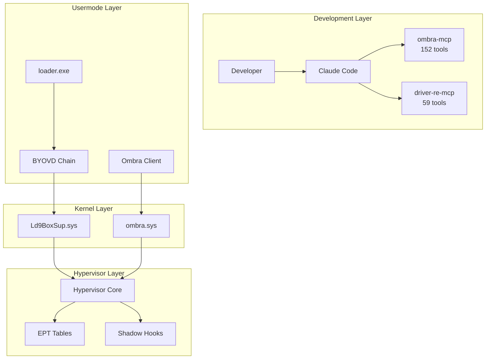
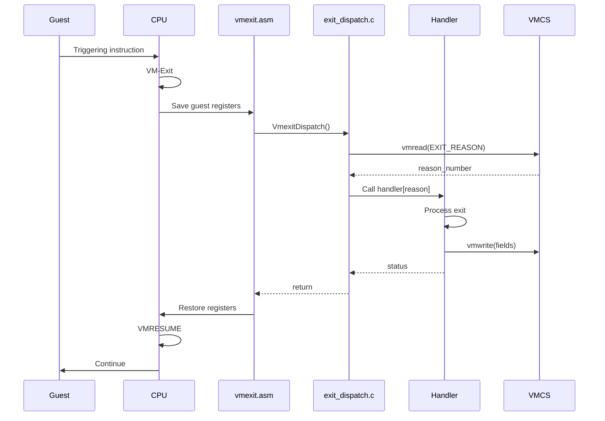
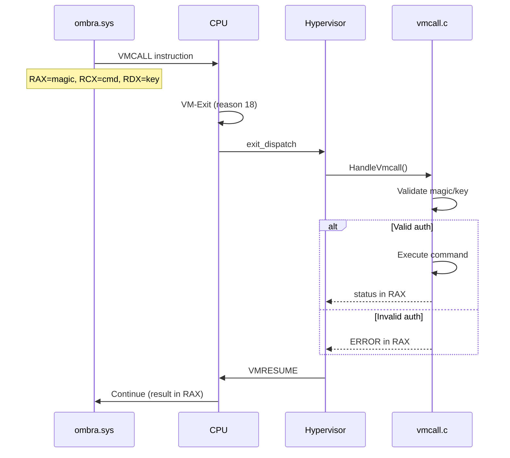
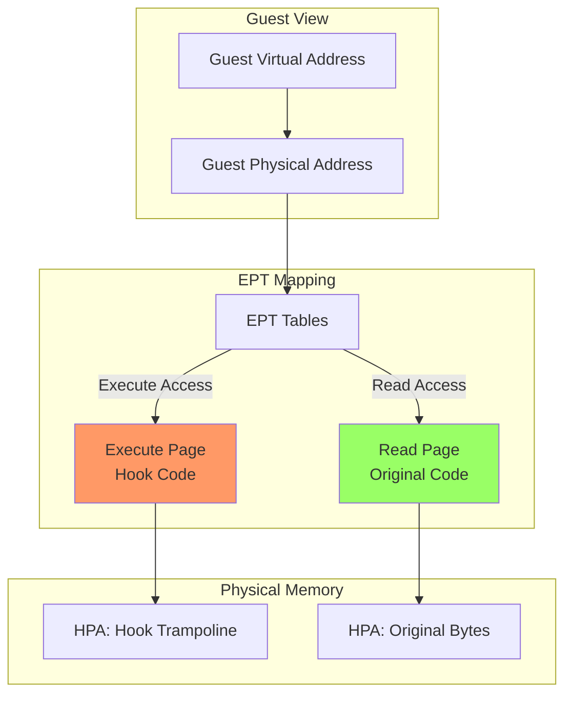
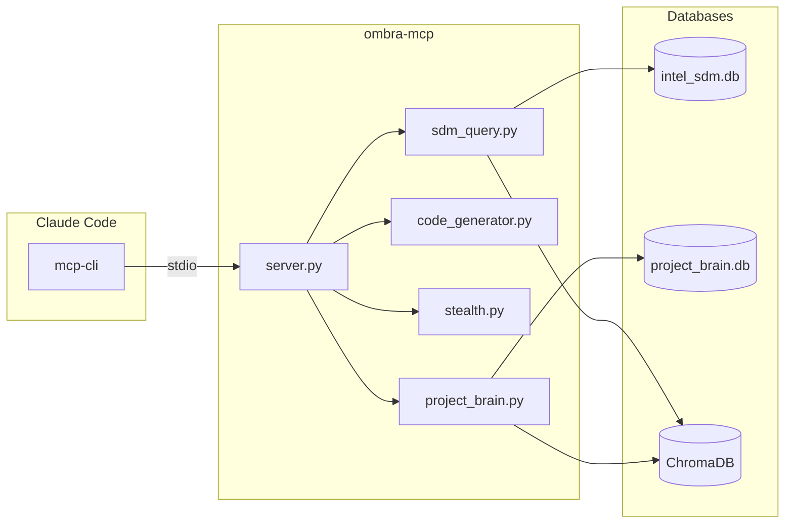
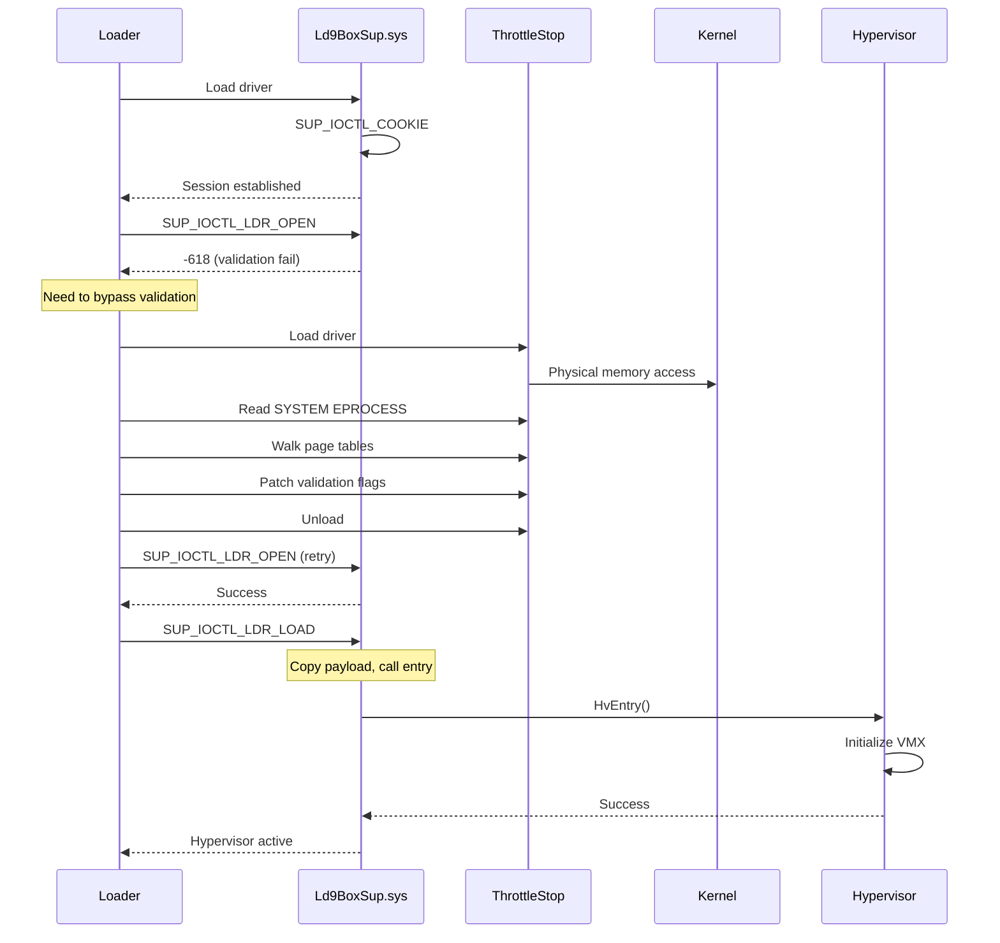
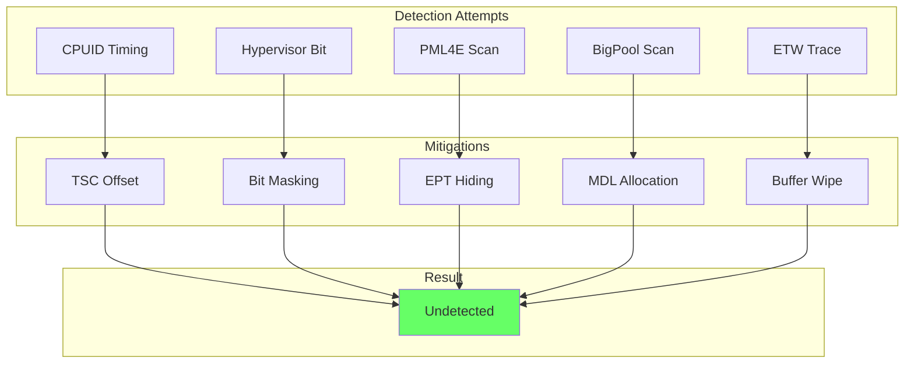
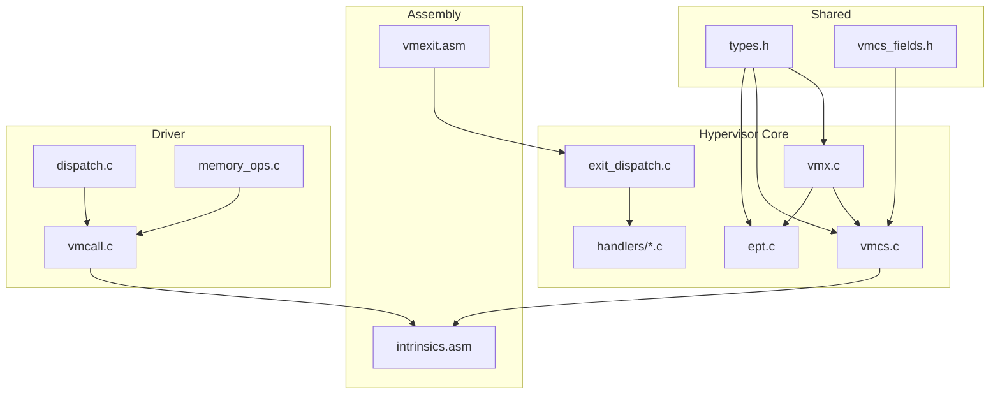
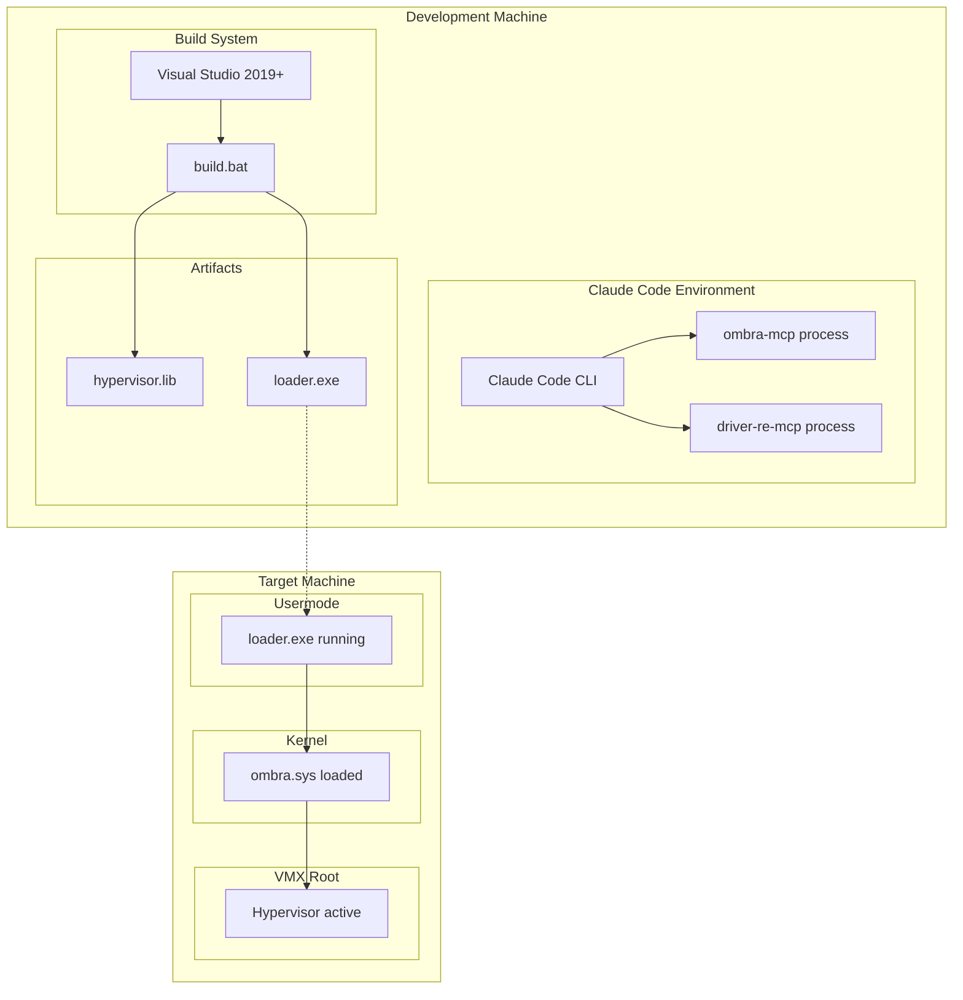

# Architecture Diagrams

This document contains all Mermaid diagrams for PROJECT-OMBRA architecture visualization.

## System Overview



## VM-Exit Processing Flow



## VMCALL Protocol



## EPT Split-View Hook



## MCP Tool Architecture



## Database Relationships

```mermaid
erDiagram
    DRIVERS ||--o{ SECTIONS : has
    DRIVERS ||--o{ IMPORTS : has
    DRIVERS ||--o{ EXPORTS : has
    DRIVERS ||--o{ IOCTLS : has
    DRIVERS ||--o{ FUNCTIONS : has
    DRIVERS ||--o{ VULNERABILITIES : has

    FUNCTIONS ||--o{ XREFS : from
    FUNCTIONS ||--o{ XREFS : to

    STRUCTURES ||--o{ STRUCTURE_MEMBERS : contains

    IOCTLS ||--o| FUNCTIONS : handler
    IOCTLS ||--o| STRUCTURES : input
    IOCTLS ||--o| STRUCTURES : output

    VULNERABILITIES ||--o{ ATTACK_CHAINS : uses

    ANALYSIS_SESSIONS ||--o{ ANALYSIS_NOTES : contains
```

## Timing Compensation

```mermaid
graph TB
    subgraph "Without Compensation"
        A1[Guest RDTSC: 1000]
        A2[VM-Exit: +500 cycles]
        A3[Handler: +200 cycles]
        A4[VM-Entry: +300 cycles]
        A5[Guest RDTSC: 2000]
        A6[Delta: 1000 cycles<br/>DETECTED]
    end

    subgraph "With Compensation"
        B1[Guest RDTSC: 1000]
        B2[VM-Exit: +500 cycles]
        B3[Handler: +200 cycles<br/>Record overhead]
        B4[VM-Entry: +300 cycles]
        B5[Guest RDTSC: 2000<br/>Apply -1000 offset]
        B6[Delta: 0 cycles<br/>HIDDEN]
    end

    A1 --> A2 --> A3 --> A4 --> A5 --> A6
    B1 --> B2 --> B3 --> B4 --> B5 --> B6

    style A6 fill:#f66
    style B6 fill:#6f6
```



## BYOVD Exploitation Chain



## Anti-Detection Layers



## Component Dependency Graph



## Deployment Architecture



## Usage

These diagrams use [Mermaid](https://mermaid.js.org/) syntax. To render:

1. **VS Code**: Install "Mermaid Markdown Preview" extension
2. **GitHub**: Renders natively in markdown files
3. **Docusaurus**: Use `@docusaurus/theme-mermaid` plugin
4. **Online**: Paste into [Mermaid Live Editor](https://mermaid.live/)

## Related Documents

- [00-OVERVIEW.md](./00-OVERVIEW.md) - Architecture overview
- [03-C4-COMPONENTS.md](./03-C4-COMPONENTS.md) - Component details
- [05-SECURITY-ARCHITECTURE.md](./05-SECURITY-ARCHITECTURE.md) - Security model
